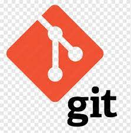

<h3 align="center"></h3>

## **About Me:**

💻 I'm an experienced <strong>Java Developer</strong> with a deep passion for crafting scalable and maintainable web applications using technologies like <strong>Java, Spring Boot, Hibernate, JDBC</strong>, and <strong>SQL</strong>.

🨠I also have a solid frontend background, building interactive and user-friendly interfaces with <strong>React.js, Angular, HTML, CSS</strong>, and <strong>JavaScript</strong>. My expertise spans both frontend and backend development, enabling me to contribute across the full stack.

🛠️ I specialize in designing and developing <strong>RESTful APIs</strong>, building applications using <strong>Microservices architecture</strong>, and securing them with <strong>JWT authentication</strong>.

🚀 I'm a strong advocate of clean code, performance optimization, and best security practices. I use <strong>Git</strong> for version control and love collaborating with others to build meaningful software.

🙠Thanks for visiting my profile — feel free to explore my repositories or connect with me!

 📫 How to reach me **ratanrudra010@gmail.com**
<h3 align="left">Connect with me:</h3>

## **Skills & Technologies:**

<h3>Programming Languages:</h3>

<h3 align="left">Backend Languages:</h3>
 

<h3 align="left">Frontend Languages:</h3>
 
 

 

<h3 align="left">Databases:</h3>

 

<h3 align="left">Cloud and Devops:</h3> 

 

<h3 align="left">Programming and Editing Tools:</h3>
 
 
 

  
 

## **My profile stats here:**

   

 
  
   

  

 
  Visitors : 
  

